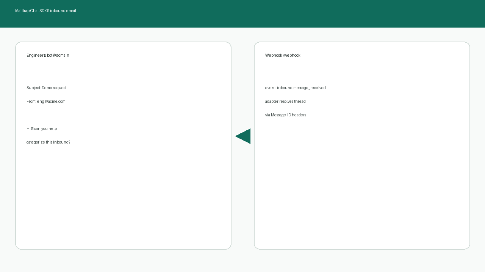

# @mailtrap/chat-sdk-adapter

Vercel Chat SDK adapter for [Mailtrap](https://mailtrap.io) email. Bidirectional: receive emails via Mailtrap Inbound webhooks, send replies via the Mailtrap Email API.



## Install

```bash
npm add @mailtrap/chat-sdk-adapter chat @chat-adapter/state-memory
```

## Quick Start

```ts
import { createMailtrapAdapter } from "@mailtrap/chat-sdk-adapter";
import { MemoryStateAdapter } from "@chat-adapter/state-memory";
import { Chat } from "chat";

const mailtrap = createMailtrapAdapter({
  fromAddress: "bot@yourdomain.com",
  fromName: "My Bot", // optional
  // apiKey: "...",           // or set MAILTRAP_API_TOKEN
  // webhookSecret: "...",    // or set MAILTRAP_WEBHOOK_SECRET
  // category: "chat-sdk",    // Email API category on every outbound send
});

const chat = new Chat({
  userName: "email-bot",
  adapters: { mailtrap },
  state: new MemoryStateAdapter(),
});

// New inbound email (new thread)
chat.onNewMention(async (thread, message) => {
  await thread.subscribe();
  await thread.post(`Got your email: ${message.text}`);
});

// Follow-up email in a subscribed thread
chat.onSubscribedMessage(async (thread, message) => {
  await thread.post(`Reply: ${message.text}`);
});
```

Point your Mailtrap Inbound webhook at your server's `/webhook` endpoint. See [examples/basic](./examples/basic) for a full working server.

## Acceptable use

This adapter is for **inbound / opted-in** email loops: support replies, form submissions, demo requests, and other conversations the recipient started or agreed to.

Do **not** use it for cold outreach, scraped lists, or unsolicited sales prospecting. See Mailtrap's Acceptable Use Policy.

## Configuration

### Environment Variables

| Variable | Description |
|---|---|
| `MAILTRAP_API_TOKEN` | Mailtrap API token (overridden by `config.apiKey`) |
| `MAILTRAP_WEBHOOK_SECRET` | Webhook signing secret (overridden by `config.webhookSecret`) |
| `FROM_ADDRESS` | Sender address (overridden by `config.fromAddress`) |
| `FROM_NAME` | Sender display name (overridden by `config.fromName`) |

### `MailtrapAdapterConfig`

```ts
interface MailtrapAdapterConfig {
  /** Sender email address. Falls back to FROM_ADDRESS. */
  fromAddress?: string;
  /** Display name for the From header. Falls back to FROM_NAME. */
  fromName?: string;
  /** Mailtrap API token. Falls back to MAILTRAP_API_TOKEN. */
  apiKey?: string;
  /** Webhook signing secret. Falls back to MAILTRAP_WEBHOOK_SECRET. */
  webhookSecret?: string;
  /** Email API `category` field (shown as X-MT-Category in SMTP/logs). Defaults to "chat-sdk". */
  category?: string;
}```

## Features

### Email Threading

Threads are resolved using standard `Message-ID`, `In-Reply-To`, and `References` email headers. Reply chains are automatically grouped into Chat SDK threads.

### Outbound category

Every agent-sent message includes Mailtrap Email API `category` (dashboard `X-MT-Category`) so samples filter cleanly. Default: `chat-sdk`.

### Send Emails Proactively

For **opted-in** contacts only, start a new email thread:

```ts
const threadId = await chat.getAdapter("mailtrap").openDM("user@example.com");
const thread = await chat.thread("mailtrap", threadId);
await thread.post("Hello from the bot!");
```

## Unsupported Operations

Email is inherently one-shot. The following operations throw `NotImplementedError`:

- `editMessage` / `deleteMessage`
- `addReaction` / `removeReaction`
- `startTyping`

## Example

| Example | Description |
|---|---|
| [basic](./examples/basic) | Echo / ack bot — replies to inbound and follow-ups |

```bash
cd examples/basic
cp .env.example .env
# fill MAILTRAP_API_TOKEN, MAILTRAP_WEBHOOK_SECRET, FROM_ADDRESS
npm install
npm start
```

Requires a verified sending domain and Mailtrap Inbound (custom domain webhook) pointed at `POST /webhook`. Uses the production Email API — not Sandbox.

## Publishing

The `@mailtrap` npm org is owned by Mailtrap. This repo prepares `@mailtrap/chat-sdk-adapter@0.1.0` for publish:

```bash
npm run build
npm publish --access public
```

Coordinate the initial publish and version bumps with Mailtrap until org ownership/transfer is complete.

## Documentation

- [Vercel Chat SDK](https://chat-sdk.dev)
- [Mailtrap API](https://docs.mailtrap.io/developers)
- [Mailtrap Inbound](https://docs.mailtrap.io/inbound-email/overview)
- [Inbound webhooks](https://docs.mailtrap.io/inbound-email/webhooks)
- [Email categories](https://docs.mailtrap.io/email-api-smtp/analytics/categories)

## License

MIT — see [LICENSE](LICENSE).
